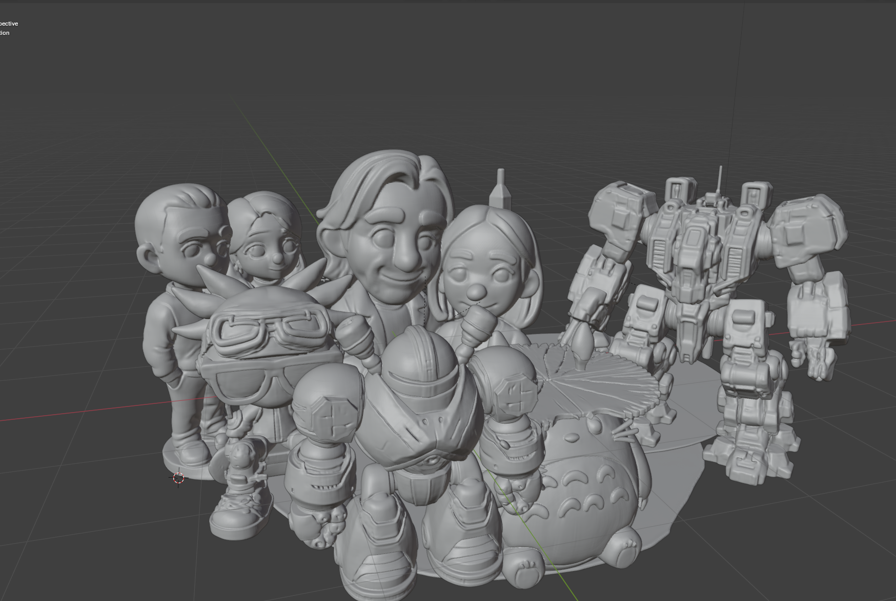
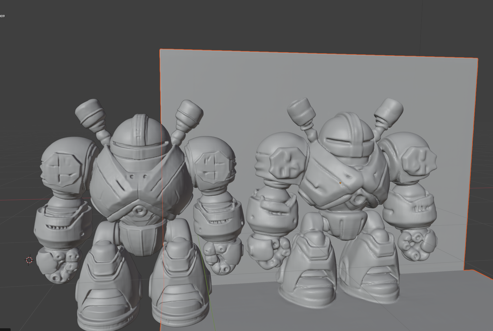

  

## What's this?
After some experiments with the ShapeVAE in Hunyuan 2.1 and unconditional guidance I came to believe that it was capable of generating much better and sharper models than it typically was, but that conditioning wasn't working that great. This branch contains two hacks that for me greatly improve generation quality of Hunyuan 2.1:

1. Adaptive Classifier Free Guidance. Increase the classifier guidance weight a lot...but minimize it at the beginning and end of the scheduling (where it seems to be very wrong and out of sync with the unconditional guidance)
2. Train a LORA on a set of high quality models, conditioned on a learned token. Insert this token in to the conditioning at generation (with the LORA). I used about 50 models for 30 epochs with a rank and alpha of 8 in the first example. Still tweaking the options!

With both of these applied the results are something like this:

  

This repo contains:
     1. Lora training scripts (see lora folder) and a script for running lora inference.
     2. Changes to pipeline.py to implement the adaptive guidance. It works better with high CFG scale (~=15.0) in my experience.

Currently "train_lora.py" works much better than "train_lora_cond.py". I'm not sure why and am currently investigating. For train_lora.py you just need a folder of latents encoded by the ShapeVAE. For train_lora_cond.py you also need images.

You could train like this:
    python3 train_lora_cond.py --latents_dir /content/hunyuanlora_data --output_dir /content/condlora2 --r 8 --alpha 8 --batch_size 1 --epochs 30

I ran on an A100 in Colab. Training was unstable with 16 bits (worked in one environment, on another just continually NaNed). VRam requirements are high.

You then use the lora_inference.py script (or build something out of it more likely)